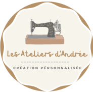

#  &nbsp;&nbsp;&nbsp; Les Ateliers d’Andrée

> Il s’agit de mon **premier projet à la sortie de l’école**, conçu dans le but de mettre en pratique mes compétences en développement web tout en créant un site réellement utile à un artisan.
> Site vitrine artisanal présentant l’univers de la couture, de la création et de la sublimation personnalisée.  
> Réalisé avec **Symfony**, il met en avant le savoir-faire de l’atelier à travers des créations uniques, entièrement personnalisables.

---

## 🌸 À propos du projet

**Les Ateliers d’Andrée** est un site vitrine conçu pour valoriser le travail artisanal autour de la couture et de la sublimation.  
L’objectif est de permettre aux visiteurs de :
- Découvrir les réalisations (sacs, accessoires, retouches, broderies, etc.)
- Prendre contact facilement pour une commande personnalisée
- Être informés des disponibilités de l’atelier et des événements (marchés, périodes de congé, etc.)

Le design du site a été pensé pour refléter la douceur, l’élégance et la passion du travail fait main.

---

## 🛠️ Technologies utilisées

- **Symfony 6**
- **Twig** (moteur de templates)
- **CSS3 / Bootstrap 5**
- **JavaScript**
- **Leaflet.js** (carte interactive)
- **Tarteaucitron.js** (gestion des cookies)
- **Font Awesome** (icônes)
- **Google Fonts** (Poppins, Diphylleia)

---

## ✨ Fonctionnalités principales

- 🪡 Présentation de l’atelier et des créations  
- 📸 Galerie dynamique avec carrousel 
- 📍 Carte interactive “Nous trouver” (Leaflet + OpenStreetMap)  
- 💬 Formulaire de contact  
- ⚠️ Fenêtre pop-up temporaire pour les annonces (ex : indisponibilité atelier)  
- 🍪 Gestion RGPD via Tarteaucitron.js  
- 📱 Design responsive (compatible mobile, tablette et ordinateur)

